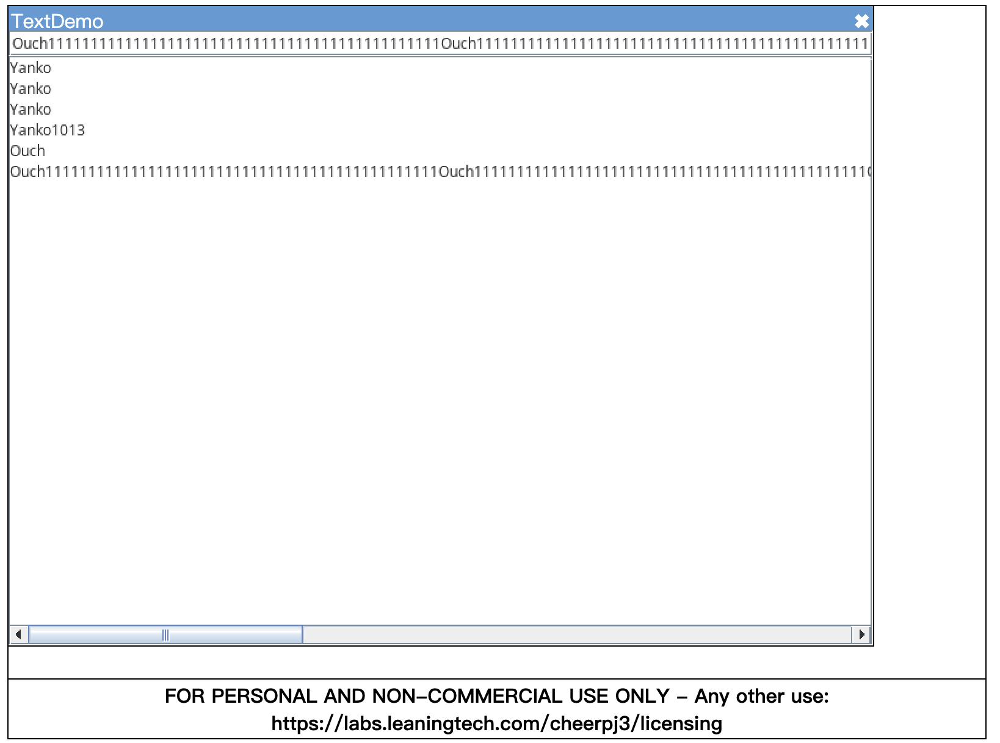
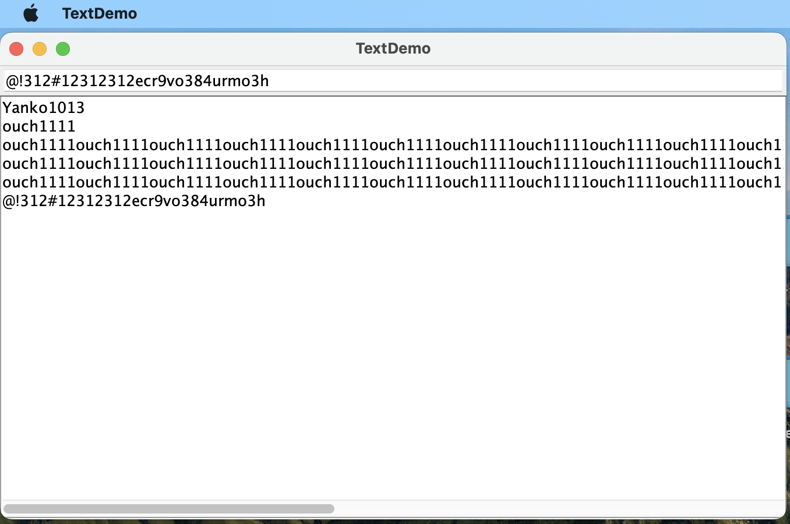

# 了解 cheerpj：在浏览器跑jvm

> [cheerpj 官网](https://cheerpj.com)


## 简单介绍

[cheerpj](https://cheerpj.com) 基于 WASM 在浏览器实现 JVM 功能，这意味着用户无需下载安装 java 环境即可在网页打开 java 应用（一般是 Java-GUI）。

使用 Java8 实现广泛兼容性（小小吐槽一下，又双叒叕是 java8，不过官网提到的未来计划会加入支持 java11），并提供完整的运行时环境，使 Java 应用程序、Java-Applet、工具库以及 Java Web Start / JNLP 应用程序能够在浏览器中运行，而无需插件。

## 用法 & demo

> 这里展示的是运行 gui 应用，还有其他用法比如`启动 applet`、`引入 java库`、`启动 JNLP`。

1. 创建一个目录，首先是创建一个 `index.html`，如下:

    ```html
    <!doctype html>
    <html lang="en">
      <head>
        <meta charset="utf-8" />
        <title>CheerpJ test</title>
        <script src="https://cjrtnc.leaningtech.com/3.0/cj3loader.js"></script>
      </head>
      <body>
        <script>
          (async function () {
            await cheerpjInit();
            cheerpjCreateDisplay(800, 600);
            await cheerpjRunJar("/app/TextDemo.jar");
          })();
        </script>
      </body>
    </html>
    ```

    参考上面引入的资源地址，再在 app/ 目录下存放一个 gui 应用编译后的 jar 文件：

    例如官方提供的 [TextDemo.jar](https://docs.oracle.com/javase/tutorialJWS/samples/uiswing/TextDemoProject/TextDemo.jar)，主要是传入二进制文件。

2. 启动服务器，访问 index.html

    ```shell
    npx http-server -p 8080 
    ```

    此时经过初始化和渲染后，页面会像这样子：

    

    可以拖拽窗口，可以输入文字，回车后填入下方文本域。

    

    其中，输入框在网页是 input 标签，下面的文本域是 canvas。（跟 figma 相似）

3. 与真JVM的效果对比

    我在电脑也装了个 java，版本如下：

    ```shell
    > java -version

    java version "1.8.0_431"
    Java(TM) SE Runtime Environment (build 1.8.0_431-b10)
    Java HotSpot(TM) 64-Bit Server VM (build 25.431-b10, mixed mode)
    ```

    然后跑 `java -jar app/TextDemo.jar`，效果如下：

    

    嗯，表现效果一致...

## 探索原理

上文的网页例子，观察网络选项卡，会发现引入的 `cj3loader.js` 又引入了相当多且大的文件，index.html + TextDemo.jar 本身也才不到 15 KB

主要引入一堆 jar 文件和 少数 wasm、字体文件。

可惜的是官方并不公布源码，但有[解释](https://cheerpj.com/docs/explanation/architecture#the-cheerpj-java-runtime-environment)，大意是：

1. cheerpj 基于 [cheerp](https://cheerp.io/)（将 c/c++ 代码转为 wasm 模块供 js使用，跟 figma 一样做法）
2. cheerpj 则是接受 jar 这种二进制码，放入 JIT 编译器转成机器码，由机器码转成 js 代码和 wasm 模块
3. 对于 java 源码里的多线程处理，在浏览器表现为调用 web worker 处理
4. 窗口转为 canvas 和 其他 dom 元素，网络请求转为 fetch

以上信息仅作参考，感谢阅读 :D
