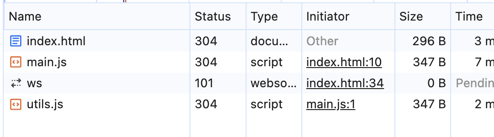
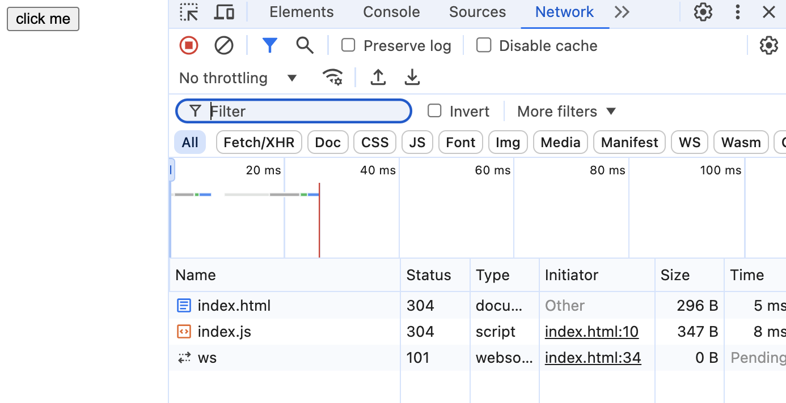

# my-webpack 实验，简单写一个webpack

首先，无论是哪个打包工具，核心内容都是：输入输出、依赖解析、模块打包，所以..

先创个空文件夹，跑个 `npm init` 搞个仪式感..

我的初始 package.json belike:

```json
{
  "name": "test",
  "version": "1.0.0",
  "description": "just for test",
  "main": "index.js",
  "scripts": {
    "build": "node config.mjs"
  },
  "keywords": [
    "test"
  ],
  "author": "Yanko1013",
  "license": "ISC"
}
```

再创个 config.js 到目录，它和执行、配置相关，就准备开始啦。

初始目录结构大概是：

```text
my-webpack/
├── src/
│   ├── index.html
│   ├── main.js
│   └── utils.js
├── dist/
├── extensions/
├── config.mjs
└── package.json
```

config.mjs 将作为打包的配置文件和程序入口，所以记得在 package.json 里写入 `"build": "node config.mjs"`。

`extensions/` 里放 loader 和 plugin。

## 打包目标

打包前，开个服务器访问 xxx/my-webpack/src/index.html


功能很简单，就是 点击按钮输出 "Hello World"

此时，我们打开 Network 选项卡，会看到加载了



静态资源加载了 index.html, main.js, utils.js，那么我们先定一个小目标：**只加载一个 js 文件**。

main.js:

```js
import Hello from './utils.js'

export function runClick() {
  const hello = new Hello('World')
  document.querySelector('p').innerHTML =  hello.sayHello()
}
// 挂载 window
window.runClick = runClick
```

utils.js:

```js
class Hello {
  constructor(target) {
    this.target = target
  }

  sayHello() {
    return `Hello ${this.target}!`
  }
}

export default Hello
```

在 index.html 引入 main.js:

```html
<body>
  <button onclick="runClick()">click me</button>
  <p></p>
  <script type="module" src="./main.js"></script>
</body>
```

## 简单分析下要做什么

> 打包目标：只加载一个且经过压缩的 js 文件。

那么我们需要...

- 从入口文件开始，找一共用了多少文件（依赖解析）
- 对代码做压缩、转换
- 结尾工作

上面是 loader 用武之处，那么再引入 plugin 的话，我选择模仿 HtmlWebpackPlugin，打包到最后创建一个新的 html 文件输出。

## 依赖解析

## 整理代码

因为最终是一个文件，所以我先把代码都弄到一块...

可预见的 import, export 等语句要被移除

todo

哪些可以被删除？

注释，换行符，一些空格

## 结尾工作

## 打包结果



好！现在只加载一个 js 了，并且占用空间大大降低

## 源码

[GitHub 个人仓库 my-webpack 源码](https://github.com/Yanko1013/funny/tree/main/my-webpack)

## 未来计划

这玩具还挺好玩，就再多玩一下：

1. Loader: Class 转成 Function
2. Loader: 仿 url-loader
3. uglify JS
4. ...

**感谢阅读！如有错误，欢迎指正噢！**
