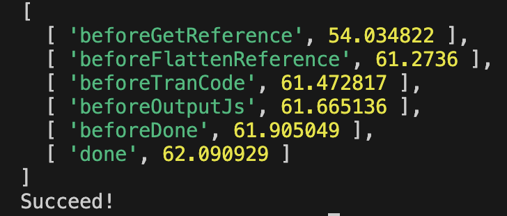

<!--
my-webpack 实验，简单写一个 webpack，模仿打包工具的核心内容：输入输出、依赖解析、文件处理...
-->
# my-webpack 实验，简单写一个webpack

> 个人学习作品，如有错误，欢迎指正！

首先，无论是哪个打包工具，核心内容都是：输入输出、依赖解析、文件处理，所以..

先创个空文件夹，跑个 `npm init` 搞个仪式感..

我的初始 package.json belike:

```json
{
  "name": "test",
  "version": "1.0.0",
  "description": "just for test",
  "main": "index.js",
  "scripts": {
    "build": "node config.mjs"
  },
  "keywords": [
    "test"
  ],
  "author": "Yanko1013",
  "license": "ISC"
}
```

再创个 config.js 到目录，它和执行、配置相关，就准备开始啦。

目录结构：

```text
my-webpack/
├── src/
│   ├── index.html
│   ├── main.js
│   └── utils.js
├── dist/
├── extensions/
│   ├── loader.mjs
│   ├── plugin.mjs
├── config.mjs
├── customize.json
└── package.json
```

config.mjs 将作为打包的配置文件和程序入口，所以记得在 package.json 里写入 `"build": "node config.mjs"`。

`extensions/` 里放 loader 和 plugin。

我的参数 customize.json：

```json
{
  "baseDir": "./src",
  "entryFile": "./src/main.js",
  "outputPath": "./dist",
  "htmlTemplateFile": "./src/index.html",
  "bundleName": "index.js"
}
```

## 打包目标

打包前，开个服务器访问 xxx/src/index.html


功能很简单，就是 点击按钮输出 "Hello World"

此时，我们打开 Network 选项卡，会看到加载了


静态资源加载了 index.html, main.js, utils.js，那么我们先定一个小目标：**只加载一个 js 文件**。

main.js:

```js
import Hello from './utils.js'

export function runClick() {
  const hello = new Hello('World')
  document.querySelector('p').innerHTML =  hello.sayHello()
}
// 挂载 window
window.runClick = runClick
```

utils.js:

```js
class Hello {
  constructor(target) {
    this.target = target
  }

  sayHello() {
    return `Hello ${this.target}!`
  }
}

export default Hello
```

在 index.html 引入 main.js:

```html
<body>
  <button onclick="runClick()">click me</button>
  <p></p>
  <script type="module" src="./main.js"></script>
</body>
```

## 简单分析下要做什么

> 打包目标：只加载一个且经过压缩的 js 文件。

那么我们需要...

- 从入口文件开始，找一共用了多少文件（依赖解析）
- 对代码做压缩、转换
- 结尾工作

上面是 loader 用武之处，那么再引入 plugin 的话，我选择模仿 HtmlWebpackPlugin，打包到最后创建一个新的 html 文件输出。

那么我的配置大概写成这样.. 完整代码可以看 `源码` 部分。

另外引入了 Proxy 封装生命周期对象，只是简单记录下时间。

```js
import fs from 'fs'
import path from 'path'
import esprima from 'esprima'
import esquery from 'esquery'
import { myHtmlWebpackPlugin } from './extensions/plugin.mjs'
import { tranCode } from './extensions/loader.mjs'
import customize from './customize.json' assert { type: 'json' }

class MyWebpack {
  constructor(baseDir, entryFile, outputPath, htmlTemplateFile, bundleName) {}

  initLifeCycle() {}

  getCostTime() {}

  // 主入口
  async run() {
    try {
      // 第一步 解析依赖
      const refMap = await this.getReference()

      // 第二步 扁平化依赖
      const refString = await this.flattenReference(refMap)

      // 第三步 代码转换、压缩。应用 Loader
      const codeString = await applyLoaders(refString)

      // 第四步 输出新 js
      await this.outputJs(codeString)

      // 第五步 收尾，应用 plugin
      await this.done()

    } catch (err) {
      console.error(err)
    }
  }
}

const myWebpack = new MyWebpack(baseDir, entryFile, outputPath, htmlTemplateFile, bundleName)
await myWebpack.run()
```

## 依赖解析

依赖解析需要从入口开始，递归到最后一层。那么就避免不了解析 `import xxx from xxx` 了。

这里我选用 esprima, esquery。前者把js代码解析成 AST，后者查询 AST。

最终把入口和它的依赖，作为 key-value 存在一个 map 里。

```js
// 递归找依赖
// 用了 esprima 解析 js -> ast ; esquery 查询 ast
async getRefByArray(filePath) {
  let refArray = new Array()
  refArray.push(filePath)

  const code = fs.readFileSync(filePath, 'utf-8'); // string
  const ast = esprima.parseModule(code); // object
  const importDeclarations = esquery(ast, 'ImportDeclaration'); // array

  // 本层的 import
  const imports = importDeclarations.map(declaration => declaration.source.value);
  // 递归
  for (let i = 0; i < imports.length; i++) {
    const importPath = imports[i]
    const fullPath = path.join(baseDir, path.basename(importPath))
    const result = await this.getRefByArray(fullPath)
    refArray.push(result)
  }

  return refArray
}
```

我们现在得知了依赖信息，下一步就是整理了

## 整理代码/整理资源

因为最终是一个文件，所以我先把代码都弄到一块... 从依赖信息（数组）遍历，获取所有字符串拼接即可。

```js
// 扁平，代码全部归到一个文件
async flattenReference(refMap) {
  let refArr = refMap.get(this.entryFile)
  refArr = refArr.flat(refArr.length)
  // 反转一下，让依赖排前面，避免找不到
  refArr = refArr.reverse()

  let result = ''
  for (let i = 0; i < refArr.length; i++) {
    const code = fs.readFileSync(refArr[i], 'utf-8');
    result = result.concat('\n', code)
  }

  return result
}
```

现在所有代码都在一个字符串变量里了，开始清理无用代码啦

### 应用 loader

写一个 loader.mjs 放在 extensions/里，我的处理步骤：

1. 先以换行符，切割整个字符串成数组
2. 由于变成一个文件，自然 `import`, `export` 等语句要被删除和修改。
3. 去除注释语句
4. 去除多余空格、换行符
5. 特殊处理
6. 拼接返回

我的 loader.mjs:

```js
// 转成一个上下文；去除不必要符号和文本
export async function tranCode(refString) {
  let res = ""
  const arr = refString.split('\n')

  for(let i=0; i<arr.length; i++) {
    const trim = arr[i].trim()
    let line = trim
    if(trim.startsWith('import')) {
      line = ''
    }
    if(trim.startsWith('//')) {
      line = ''
    }
    if(trim.startsWith('export')) {
      if(!trim.includes('function')) {
        line = ''
      } else {
        line = trim.replace(/^export\s+/, '')
      }
    }
    // 特殊处理：如果是 "document"，前面需要加个 ';'
    if(trim.startsWith('document')) {
      line = ';' + line
    }
    res += line.trim()
  }
  
  return res
}

```

然后就把得到的 js 用 fs 模块写到导出目录里即可。

大概结果是这样

```js
class Hello {constructor(target) {this.target = target}sayHello() {return `Hello ${this.target}!`}}function runClick() {const hello = new Hello('World');document.querySelector('p').innerHTML =  hello.sayHello()}window.runClick = runClick
```

## 结尾工作

### 应用 plugin

现在我们得到了一个 js 文件，自然也要有 html 文件啦。

写一个 plugin.mjs，放在 extensions/

替换本次打包实例的生命周期函数，读取一个模版，然后替换或者加入打包出来的 js 文件路径，再输出即可。

```js
import fs from 'fs'
import path from 'path'

// 模拟输出 html 文件
export async function myHtmlWebpackPlugin(myWebpackInstance) {
  // 用 bind 处理 this 指向
  myWebpackInstance.done = createHtml.bind(myWebpackInstance)
}

async function createHtml() {
  const originalHtml = fs.readFileSync(this.htmlTemplateFile, 'utf-8');
  const entryFileName = this.entryFile.split('/').at(-1)
  
  let handledHtml = originalHtml.replace(entryFileName, this.bundleName)
  const filePath = path.join(this.outputPath, 'index.html')

  fs.writeFile(filePath, handledHtml, 'utf8', (err) => {
    if (err) {
      console.error(err);
    } else {
      console.log('Succeed!');
    }
  })
}

```

## 打包结果

执行 `npm run build`

访问 xxx/dist/index.html


好！现在只加载一个 js 了，并且占用空间大大降低

时间还行，10毫秒内完成（毕竟文件少又小）



## 源码

[GitHub_my-webpack](https://github.com/Yanko1013/funny/tree/main/my-webpack)

或者看这个也许，我的配置文件 config.mjs：

```js
import fs from 'fs'
import path from 'path'
import esprima from 'esprima'
import esquery from 'esquery'
import { myHtmlWebpackPlugin } from './extensions/plugin.mjs'
import { tranCode } from './extensions/loader.mjs'
import customize from './customize.json' assert { type: 'json' }

class MyWebpack {
  constructor(baseDir, entryFile, outputPath, htmlTemplateFile, bundleName) {
    this.baseDir = baseDir
    this.entryFile = entryFile
    this.outputPath = outputPath
    this.htmlTemplateFile = htmlTemplateFile
    this.bundleName = bundleName

    this.lifeCycle = this.initLifeCycle()
  }

  initLifeCycle() {
    const target = {
      status: 'pending',
      timeRecord: new Map()
    }
    const handler = {
      get(target, property) {
        return target[property]
      },
      // 记下各阶段开启时间
      set(target, property, value) {
        const curTime = performance.now()
        target.timeRecord.set(value, curTime)
        target[property] = value
        return true
      }
    }
    return new Proxy(target, handler)
  }

  getCostTime() {
    return Array.from(this.lifeCycle.timeRecord)
  }

  /**
   * 目标：
   * 1. 所有 js 变成一个 js
   * main.js     ├── index.js
   *  - utils.js │
   * 
   * 2. 创建新 html 文件，并应用新的 js 文件
   * 
   * 这只是我个人的想法哦，仅供参考
   */
  async run() {
    try {
      // 第一步 解析依赖
      this.lifeCycle.status = 'beforeGetReference'
      const refMap = await this.getReference()

      // 第二步 扁平化依赖
      this.lifeCycle.status = 'beforeFlattenReference'
      const refString = await this.flattenReference(refMap)

      // 第三步 代码转换、压缩。应用 Loader
      this.lifeCycle.status = 'beforeTranCode'
      const codeString = await applyLoaders(refString)

      // 第四步 输出新 js
      this.lifeCycle.status = 'beforeOutputJs'
      await this.outputJs(codeString)

      // 第五步 收尾，应用 plugin
      this.lifeCycle.status = 'beforeDone'
      await this.done()

      this.lifeCycle.status = 'done'

    } catch (err) {
      console.error(err)
    }
  }

  async getReference() {
    const map = new Map()
    // 想法是，以 entryFile 作为key，值为本文件引用的依赖
    // Map<string, string[]>
    const refArray = await this.getRefByArray(this.entryFile)
    map.set(this.entryFile, refArray)
    return map
  }

  // 递归找依赖
  // 用了 esprima 解析 js -> ast ; esquery 查询 ast
  async getRefByArray(filePath) {
    let refArray = new Array()
    refArray.push(filePath)

    const code = fs.readFileSync(filePath, 'utf-8'); // string
    const ast = esprima.parseModule(code); // object
    const importDeclarations = esquery(ast, 'ImportDeclaration'); // array

    // 本层的 import
    const imports = importDeclarations.map(declaration => declaration.source.value);
    // 递归
    for (let i = 0; i < imports.length; i++) {
      const importPath = imports[i]
      const fullPath = path.join(baseDir, path.basename(importPath))
      const result = await this.getRefByArray(fullPath)
      refArray.push(result)
    }

    return refArray
  }

  // 扁平，代码全部归到一个文件
  async flattenReference(refMap) {
    let refArr = refMap.get(this.entryFile)
    refArr = refArr.flat(refArr.length)
    // 反转一下，让依赖排前面，避免找不到
    refArr = refArr.reverse()

    let result = ''
    for (let i = 0; i < refArr.length; i++) {
      const code = fs.readFileSync(refArr[i], 'utf-8');
      result = result.concat('\n', code)
    }

    return result
  }

  // 创建 js 文件 把转换后的代码写入
  async outputJs(codeString) {
    const filePath = path.join(this.outputPath, this.bundleName)
    fs.writeFile(filePath, codeString, 'utf8', (err) => {
      if (err) {
        console.error(err);
      }
    })
  }

  async done() { }
}

// 导入配置
const {
  baseDir,
  entryFile,
  outputPath,
  htmlTemplateFile,
  bundleName
} = customize

const myWebpack = new MyWebpack(baseDir, entryFile, outputPath, htmlTemplateFile, bundleName)

// 装载 loader
// 目前只有一个 Loader，未来更新会试着写多几个。
async function applyLoaders(codeString) {
  return await tranCode(codeString)
  /* ...more loader... */
}

// 装载 plugin
myHtmlWebpackPlugin(myWebpack)

await myWebpack.run()

console.log(myWebpack.getCostTime())

```

## 未来计划

这玩具还挺好玩，就再多玩一下：

1. Loader: Class 转成 Function
2. Loader: 仿 url-loader
3. uglify JS
4. ...

**感谢阅读！如有错误，欢迎指正噢！**
