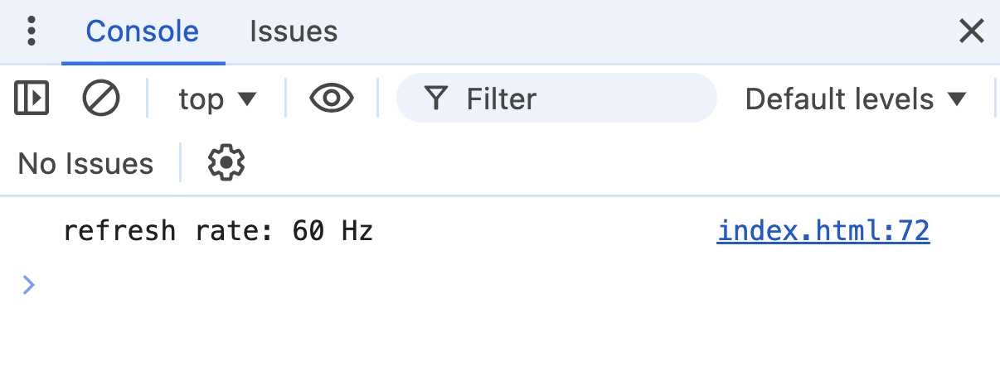
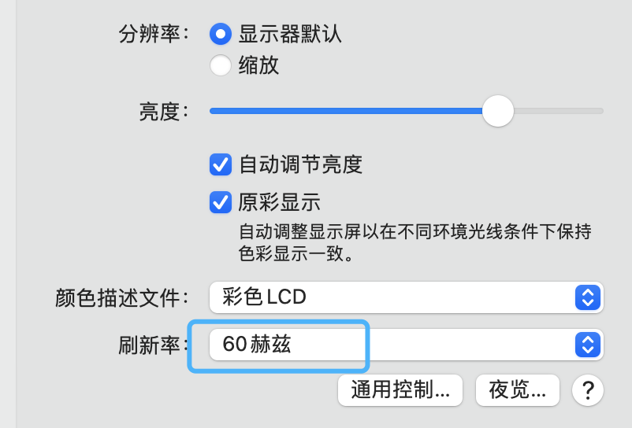
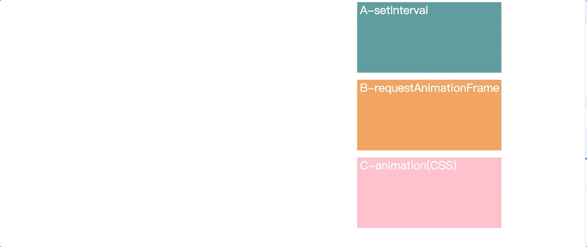

# requestAnimationFrame 实验

[requestAnimationFrame MDN](https://developer.mozilla.org/zh-CN/docs/Web/API/Window/requestAnimationFrame)

> window.requestAnimationFrame() 方法会告诉浏览器你希望执行一个动画。它要求浏览器在下一次重绘之前，调用用户提供的回调函数。

简而言之，这个方法会让动画表现得更丝滑。今天来做个小实验，看看它和js, css设置的动画的表现差异吧。

## 1. 获取帧率/屏幕刷新率

绘画离不开帧率，借助 `performance API` 可以大致得出当前屏幕刷新率。

```js
function getRefreshRate(callback) {
    let frames = 0;
    let startTime = performance.now();

    function tick() {
        frames++;
        const currentTime = performance.now();
        const duration = currentTime - startTime;

        if (duration >= 1000) {
            const fps = Math.floor(frames / duration * 1000);
            callback(fps);
        } else {
            requestAnimationFrame(tick);
        }
    }

    requestAnimationFrame(tick);
}
```

检查

```js
getRefreshRate((fps) => {
    console.log(`refresh rate: ${fps} Hz`);
})
```

结果（本人电脑）：



确实和本机设置里同值。



> 备注：这个计算帧率方法不绝对精确。

### 2. 偏移动画

设置三个元素，分别用 js-setInterval, js-requestAnimationFrame, css-animation 执行动画，对应代码：

```js
const range = 500

function runA() {
    let tX = 1
    const timer = setInterval(() => {
        boxA.style.transform = `translateX(${tX}px)`;
        tX++;
        if(tX === range + 1) {
            clearInterval(timer)
        }
    }, 1000 / FPS_VALUE)
}

function runB() {
    let tX = 1

    const animate = () => {
        boxB.style.transform = `translateX(${tX}px)`;
        tX++;
        if(tX === range + 1) {
            return;
        }
        requestAnimationFrame(animate);
    }
    
    requestAnimationFrame(animate);
}

function runC() {
    const time = (range / FPS_VALUE) + 's'
    boxC.style.animation = `moveRight ${time} linear forwards`;
}

/*
// css
@keyframes moveRight {
    from {
        transform: translateX(0);
    }
    to {
        transform: translateX(500px);
    }
}
*/
```

## 3.效果



忽略误差造成的移动速度差距，对比看出，boxA（setInterval 方法）比 boxB（requestAnimationFrame 方法），boxC（animation CSS）有些许卡顿，后两者表现相差无几。

可能 gif 表现不明显...下面有完整代码，拷贝到本地用浏览器打开即可。

<!-- [完整代码]() -->

See u! 感谢阅读
