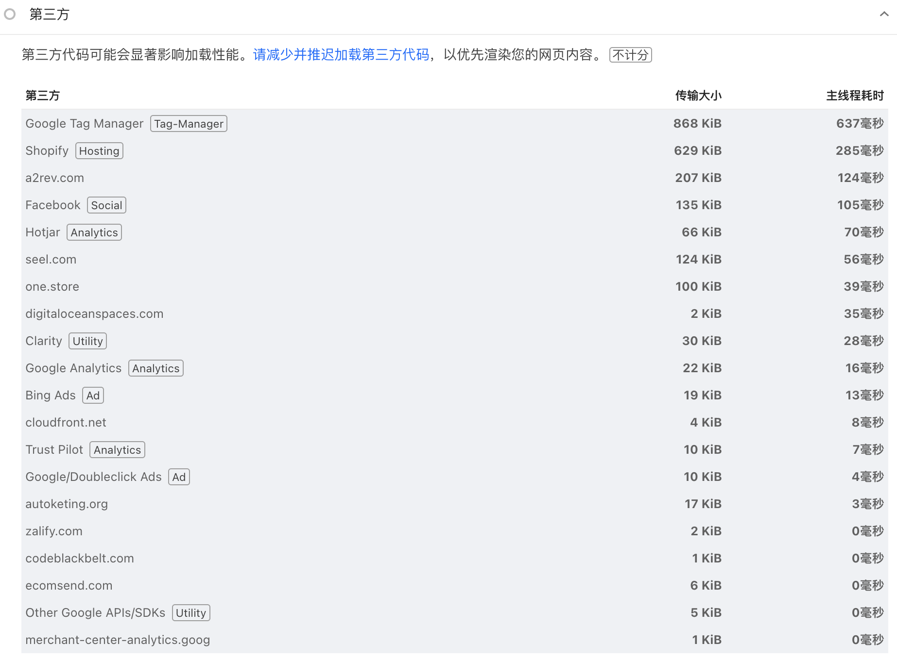
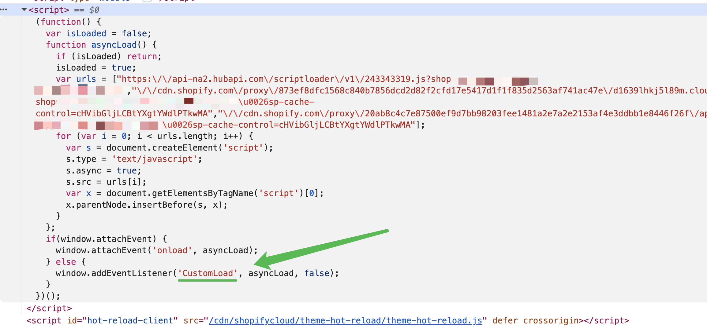

# 简单有效地提升 Shopify 站点性能：自定义加载脚本

影响性能的一个常见因素是脚本的加载、编译、执行，这点在 Shopify 站点体现得更明显，因为平台默认集成一些支付、平台监控、分析追踪等工具，加上普遍需要安装插件、引入营销类工具脚本（比如GTM）等。



一个合理的解决思路是延迟一些"次要"脚本的加载和执行，那么在 Shopify 中我们可以检视代码，看到一些第三方脚本是这么被加载进网页的：

```html
<script>(function() {
  var isLoaded = false;
  function asyncLoad() {
    if (isLoaded) return;
    isLoaded = true;
    var urls = ["https:\/\/api-na2.hubapi.com\/scriptloader\/v1\/243343319.js?shop=xxx.myshopify.com","\/\/cdn.shopify.com\/proxy\/873ef8dfc1568c840b7856dcd2d82f2cfd17e5417d1f1f835d2563af741ac47e\/d1639lhkj5l89m.cloudfront.net\/js\/storefront\/uppromote.js?shop=xxx.myshopify.com\u0026sp-cache-control=cHVibGljLCBtYXgtYWdlPTkwMA","\/\/cdn.shopify.com\/proxy\/20ab8c4c7e87500ef9d7bb98203fee1481a2e7a2e2153af4e3ddbb1e8446f26f\/api.goaffpro.com\/loader.js?shop=xxx.myshopify.com\u0026sp-cache-control=cHVibGljLCBtYXgtYWdlPTkwMA"];
    for (var i = 0; i < urls.length; i++) {
      var s = document.createElement('script');
      s.type = 'text/javascript';
      s.async = true;
      s.src = urls[i];
      var x = document.getElementsByTagName('script')[0];
      x.parentNode.insertBefore(s, x);
    }
  };
  if(window.attachEvent) {
    window.attachEvent('onload', asyncLoad);
  } else {
    window.addEventListener('load', asyncLoad, false);
  }
})();</script>
```

（attachEvent 是 IE 时代的 API，现已废弃）大致逻辑是在页面监听 [load](https://developer.mozilla.org/en-US/docs/Web/API/Window/load_event) 事件，load 触发后再通过 asyncLoad 函数逐一创建以 async 异步加载的外部脚本标签插入网页。

注意这里加载的脚本带 [async](https://developer.mozilla.org/en-US/docs/Web/HTML/Reference/Elements/script#async)，意味着加载时机可以灵活一些，因此触发 asyncLoad 的时机也可以灵活一些，我们就可以这么修改以实现自定义加载脚本了：

## 修改 content_for_header（theme.liquid）

我习惯不处理购物车页，所以判断 `template.name != 'cart'`。替换 load 为 CustomLoad：

```liquid

  {{ content_for_header | replace: "addEventListener('load'", "addEventListener('CustomLoad'" }}

  {{ content_for_header }}

```



## 触发自定义事件

在 theme.liquid 底部，body 闭合前，加入以下代码：

```html

  <script>
    const events = ['scroll', 'mousemove', 'keydown', 'click', 'touchstart'];
    let flag = false;

    function actionEvent() {
      if (flag) return;
      flag = true;
      
      window.dispatchEvent(new CustomEvent("CustomLoad"));
    }
    
    document.addEventListener('DOMContentLoaded', () => {
      events.forEach(function (eventType) {
        window.addEventListener(eventType, actionEvent, {
          passive: true,
          once: true
        });
      });
    });
  </script>

```

这样就能实现一个简单有效的延迟加载脚本控制器了，当网站用户产生交互时再加载这些脚本。

以上代码仅供参考。
